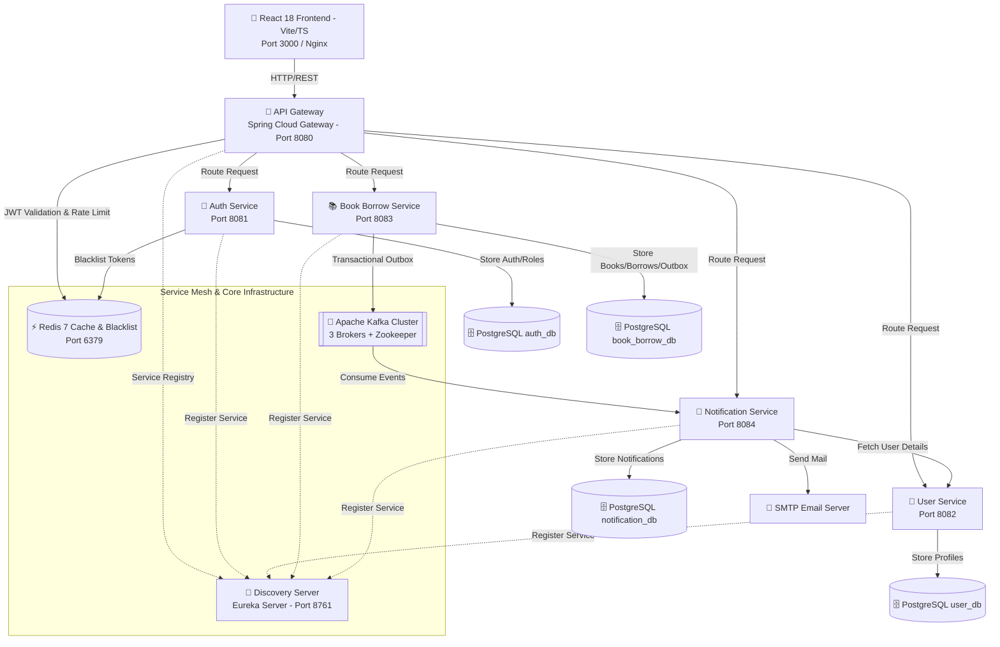
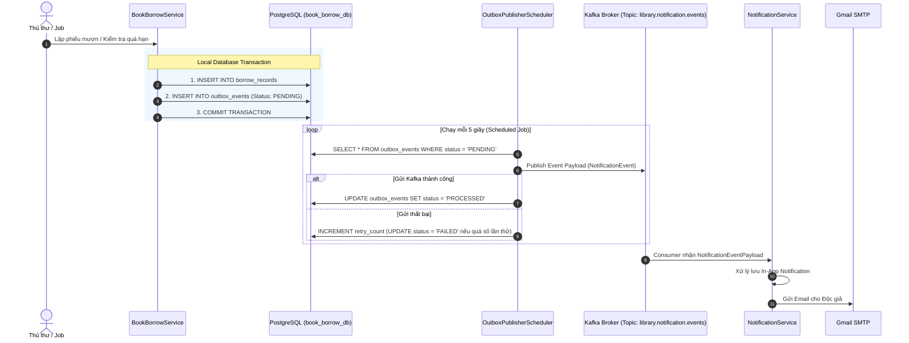
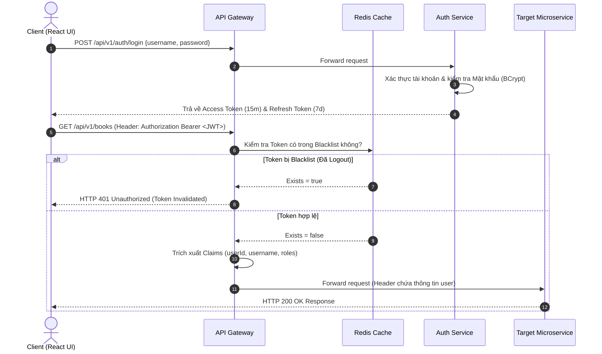

# 📚 Hệ Thống Quản Lý Thư Viện (Library Microservices Platform)
## 📐 High-Level Design (HLD) Document

Hệ thống Quản lý Thư viện là một nền tảng enterprise được xây dựng theo kiến trúc **Microservices** hiện đại, kết hợp với các mô hình thiết kế chuẩn **Domain-Driven Design (DDD)** và **Event-Driven Architecture (EDA)**. Hệ thống cung cấp giải pháp toàn diện cho việc quản lý sách, bản sao (book copies), quy trình mượn - trả sách, xử lý quá hạn, phạt tiền và tự động gửi thông báo qua Email & In-App.

---

## 🏛️ 1. Kiến Trúc Tổng Quan (System Architecture)

Hệ thống bao gồm 7 dịch vụ độc lập được container hóa bằng Docker, giao tiếp bất đồng bộ qua **Apache Kafka** và đồng bộ qua **RESTful API** điều phối bởi **API Gateway** & **Eureka Service Discovery**.

### 📊 Sơ Đồ Kiến Trúc Tổng Quan (System Architecture Diagram)



---

## 🧩 2. Danh Sách Dịch Vụ & Chức Năng (Microservices Breakdown)

### 1. 🔎 Discovery Server (`DiscoveryServer` - Port `8761`)
- **Công nghệ**: Netflix Eureka Server, Spring Cloud Netflix.
- **Vai trò**: Quản lý đăng ký và phát hiện dịch vụ (Service Registry & Discovery). Tất cả microservices tự động đăng ký heartbeat tới Eureka, giúp API Gateway và OpenFeign tự động load balancing không cần hardcode IP.

### 2. 🚪 API Gateway (`ApiGateway` - Port `8080`)
- **Công nghệ**: Spring Cloud Gateway, Reactive Netty Server, Spring Security WebFlux, Redis RateLimiter, Resilience4j.
- **Vai trò**: Cổng giao tiếp trung tâm (Single Entry Point) cho ứng dụng client.
  - **Dynamic Routing**: Định tuyến yêu cầu dựa trên thông tin Service Registry từ Eureka (`/api/v1/auth/**`, `/api/v1/user/**`, `/api/v1/books/**`, `/api/v1/borrows/**`).
  - **Global Authentication Filter**: Trích xuất và xác thực tính hợp lệ của JWT Bearer Token, đồng thời kiểm tra Token revocation trong Redis Blacklist trước khi chuyển tiếp request vào microservices phía sau.
  - **Rate Limiting & Circuit Breaker**: Giới hạn tần suất gọi API với Redis RateLimiter và bảo vệ hệ thống khỏi nổ dây chuyền với Resilience4j.

### 3. 🔐 Auth Service (`AuthService` - Port `8081`)
- **Công nghệ**: Spring Boot 4.1, Spring Security, BCrypt, JJWT (io.jsonwebtoken), Flyway Migration.
- **Vai trò**: Quản lý định danh và xác thực tài khoản.
  - Đăng ký tài khoản (`sign-up`), Đăng nhập (`login`), Làm mới Access Token (`refresh-token`).
  - Mã hóa mật khẩu chuẩn BCrypt (`PasswordEncoder`).
  - Cấp phát cặp JWT Token (Access Token sống 15 phút, Refresh Token sống 7 ngày).
  - Quản lý phiên đăng xuất (`logout`): Đưa Access Token đang dùng vào **Redis Blacklist** với thời gian TTL bằng thời hạn còn lại của Token.

### 4. 👤 User Service (`UserService` - Port `8082`)
- **Công nghệ**: Spring Boot 4.1, Spring Data JPA, OpenFeign, PostgreSQL, Flyway.
- **Vai trò**: Quản lý thông tin hồ sơ độc giả và thủ thư.
  - Cung cấp API quản lý danh sách người dùng, cập nhật thông tin cá nhân (`fullName`, `phone`).
  - Cung cấp Feign Client endpoint cho `NotificationService` và `BookBorrowService` truy vấn thông tin độc giả theo `userId`.

### 5. 📚 Book & Borrow Service (`BookBorrowService` - Port `8083`)
- **Công nghệ**: Spring Boot 4.1, Spring Data JPA, Apache Kafka Producer, Transactional Outbox Pattern, Scheduled Tasks.
- **Vai trò**: Trái tim nghiệp vụ quản lý thư viện.
  - **Quản lý Kho Sách & Bản Sao**: Thêm/sửa/xóa đầu sách (`books`), quản lý mã tài sản bản sao (`book_copies` với mã tài sản duy nhất `asset_code`), quản lý danh mục (`categories`) và nhập kho (`book_imports`).
  - **Quy trình Mượn - Trả Sách**: Tạo phiếu mượn (`borrow_records`), kiểm tra số lượng bản sao khả dụng, xử lý trả sách và tự động tính tiền phạt/ngày quá hạn.
  - **Auto Job Quá Hạn & Sắp Hạn**: Job lập lịch chạy tự động kiểm tra phiếu mượn quá hạn (`OVERDUE`), sắp tới hạn trả (`DUE_SOON`) để phát sinh sự kiện thông báo.
  - **Transactional Outbox Pattern**: Đảm bảo tính nhất quán dữ liệu ACID tuyệt đối giữa Database và Kafka Event Streaming.

### 6. 🔔 Notification Service (`NotificationService` - Port `8084`)
- **Công nghệ**: Spring Boot 4.1, Kafka Consumer, OpenFeign, JavaMailSender (SMTP), PostgreSQL.
- **Vai trò**: Xử lý thông báo bất đồng bộ.
  - **Kafka Listener**: Lắng nghe topic `library.notification.events` từ Kafka Cluster với Consumer Group `notification-group`.
  - **OpenFeign Integration**: Gọi tới `UserService` để lấy thông tin email và tên người nhận.
  - **Dual Notification**: Lưu hộp thư thông báo In-App vào PostgreSQL (`notification_db`) đồng thời gửi email thông báo trực tiếp qua SMTP Gmail server.

### 7. 📱 Frontend App (`lib-frontend` - Port `3000`)
- **Công nghệ**: React 18, TypeScript, Vite, Custom Glassmorphism Vanilla CSS Design Tokens, FontAwesome 6, Nginx Server.
- **Vai trò**: Giao diện người dùng hiện đại, bảo mật và tương tác mượt mà.
  - **Role-Based Views**: Giao diện riêng biệt cho **Thủ thư (`LIBRARIAN`)** (Dashboard tổng quan, Quản lý kho sách, Nhập bản sao, Quản lý mượn/trả, Quản lý người dùng) và **Độc giả (`BORROWER`)** (Xem kho sách, Mượn sách trực tuyến, Lịch sử mượn trả, Hộp thư thông báo).

---

## 🗄️ 3. Kiến Trúc Dữ Liệu & Mẫu Thiết Kế Outbox (Data Architecture & Outbox Pattern)

Hệ thống tuân thủ nghiêm ngặt nguyên tắc **Database-per-Service** để đảm bảo tính độc lập và khả năng mở rộng của microservices.

### 💾 Phân Bổ Database (PostgreSQL 16)
- **`auth_db`**: Chứa các bảng `users` (định danh & mật khẩu), `roles`, `user_roles`.
- **`user_db`**: Chứa bảng `user_profiles` (thông tin chi tiết độc giả/thủ thư).
- **`book_borrow_db`**: Chứa các bảng `categories`, `books`, `book_copies`, `book_imports`, `book_import_items`, `borrow_records`, và `outbox_events`.
- **`notification_db`**: Chứa bảng `notifications`.

---

### 🔄 Transactional Outbox Pattern Sequence Diagram

Để giải quyết bài toán nhất quán dữ liệu giữa ghi Database SQL và phát Event lên Kafka (tránh lỗi thất lạc thông báo khi gọi Kafka trực tiếp trong Transaction), hệ thống áp dụng **Transactional Outbox Pattern**:



---

## 🔐 4. Kiến Trúc Bảo Mật & Xác Thực (Security Architecture)

Hệ thống triển khai cơ chế **Stateless JWT Security** kết hợp với **Centralized Gateway Verification** và **Redis Token Blacklisting**.



### Phân Quyền Vai Trò (Role-Based Access Control - RBAC)
- **`LIBRARIAN`**: Toàn quyền quản trị (CRUD kho sách, lập phiếu mượn/trả, nhập kho, quản lý danh mục, xem tất cả lịch sử mượn & danh sách độc giả).
- **`BORROWER`**: Quyền độc giả (Xem danh mục sách, mượn sách trực tuyến, xem lịch sử cá nhân, xem hộp thư thông báo).

---

## ⚡ 5. Hạ Tầng & Triển Khai Docker (DevOps & Infrastructure)

Hệ thống được thiết kế để khởi chạy hoàn chỉnh chỉ với 1 câu lệnh duy nhất thông qua **Docker Compose**.

### 🛠️ Công Nghệ Hạ Tầng:
- **PostgreSQL 16**: 4 database độc lập tự động khởi tạo qua script `postgres/init.sql`.
- **Redis 7 Alpine**: Lưu trữ Token Blacklist và bộ đệm Rate Limiter.
- **Apache Kafka Cluster**: Cụm 3 Broker Kafka (`broker-1`, `broker-2`, `broker-3`) quản lý bởi Zookeeper, đảm bảo tính sẵn sàng cao (High Availability).
- **Flyway Database Migration**: Quản lý phiên bản và tự động tạo bảng DB cho từng service.

### 🌐 Bảng Phân Bổ Cổng (Port Mapping):

| Dịch Vụ / Component | Port Host | Port Container | URL / Access Endpoint |
| :--- | :--- | :--- | :--- |
| **Lib Frontend Web UI** | `3000` | `80` | [http://localhost:3000](http://localhost:3000) |
| **API Gateway** | `8080` | `8080` | [http://localhost:8080](http://localhost:8080) |
| **Eureka Discovery Server** | `8761` | `8761` | [http://localhost:8761](http://localhost:8761) |
| **Auth Service** | `8081` | `8081` | [http://localhost:8081](http://localhost:8081) |
| **User Service** | `8082` | `8082` | [http://localhost:8082](http://localhost:8082) |
| **Book Borrow Service** | `8083` | `8083` | [http://localhost:8083](http://localhost:8083) |
| **Notification Service** | `8084` | `8084` | [http://localhost:8084](http://localhost:8084) |
| **PostgreSQL Database** | `5432` | `5432` | `localhost:5432` |
| **Redis Cache** | `6379` | `6379` | `localhost:6379` |
| **Kafka Cluster** | `9092, 9093, 9094` | `19092` | `broker-1:19092, broker-2:19092, broker-3:19092` |

---

## 🚀 6. Hướng Dẫn Khởi Chạy Nhanh (Quickstart Guide)

### Yêu cầu tiên quyết:
- **Docker Desktop** (hoặc Docker Engine + Docker Compose v2).
- RAM khả dụng tối thiểu: **8GB - 16GB**.

### Bước 1: Tạo file cấu hình `.env`
Tạo file `.env` tại thư mục gốc project (`Library/`):
```env
DB_PASSWORD=root
AUTH_DB_PASSWORD=root
USER_DB_PASSWORD=root
BOOK_DB_PASSWORD=root
NOTIFICATION_PASSWORD=root
REDIS_PASS=redis123
JWT_SECRET_KEY=404E635266556A586E3272357538782F413F4428472B4B6250645367566B5970
APP_EMAIL=your-email@gmail.com
APP_EMAIL_PASSWORD=your-app-password
```

### Bước 2: Khởi chạy toàn bộ hệ thống
```bash
docker compose up --build -d
```

### Bước 3: Kiểm tra trạng thái
```bash
docker compose ps
```
> Chờ khoảng 1 - 2 phút để các container Java khởi động hoàn tất và đạt trạng thái `healthy`. Sau đó truy cập giao diện tại **[http://localhost:3000](http://localhost:3000)**.

---

## 📌 7. Danh Sách RESTful API Chính (Core API Endpoints)

Tất cả request từ client được gửi qua **API Gateway (`http://localhost:8080`)**:

### 🔐 Authentication (`/api/v1/auth`)
- `POST /api/v1/auth/login`: Đăng nhập cấp JWT Access & Refresh Token.
- `POST /api/v1/auth/sign-up`: Đăng ký tài khoản người dùng mới.
- `POST /api/v1/auth/refresh`: Làm mới Access Token.
- `POST /api/v1/auth/logout`: Đăng xuất và đưa Token vào Redis Blacklist.

### 👤 User Management (`/api/v1/user`)
- `GET /api/v1/user/all`: Lấy danh sách tất cả người dùng (Thủ thư).
- `GET /api/v1/user/profile`: Lấy thông tin tài khoản hiện tại.
- `PUT /api/v1/user/{userId}`: Cập nhật thông tin `fullName` & `phone`.
- `DELETE /api/v1/user/{userId}`: Xóa người dùng.

### 📚 Books & Categories (`/api/v1/books`, `/api/v1/categories`)
- `GET /api/v1/books`: Lấy danh sách tất cả các đầu sách và tổng số bản sao.
- `POST /api/v1/books`: Tạo đầu sách mới.
- `POST /api/v1/books/{id}/import`: Nhập số lượng bản sao mới cho sách.
- `GET /api/v1/categories`: Lấy danh sách danh mục sách.

### 📖 Borrow Transactions (`/api/v1/borrows`)
- `POST /api/v1/borrows`: Lập phiếu mượn sách.
- `PUT /api/v1/borrows/{borrowCode}/return`: Thực hiện thủ tục trả sách.
- `GET /api/v1/borrows/my-history`: Xem lịch sử mượn trả của độc giả hiện tại.
- `GET /api/v1/borrows/all`: Xem tất cả phiếu mượn hệ thống.

---

## 📝 8. Giấy Phép & Đóng Góp (License)
Dự án được xây dựng và duy trì nhằm mục đích minh họa kiến trúc phần mềm **Enterprise Microservices**, áp dụng các tiêu chuẩn thiết kế hiện đại nhất trong hệ sinh thái Java Spring Boot & React TypeScript.
