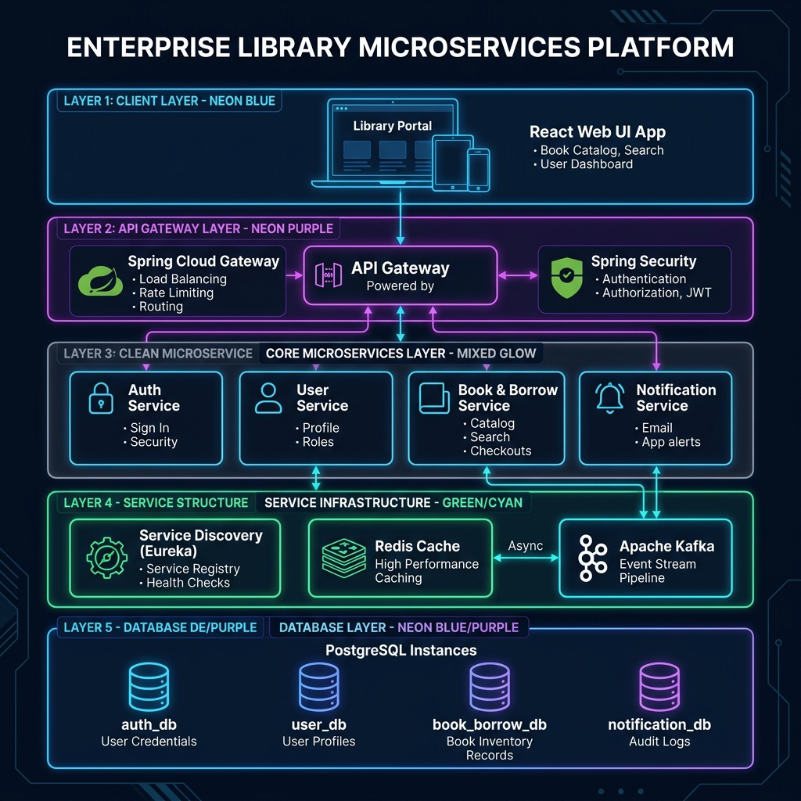

# 📚 Hệ Thống Quản Lý Thư Viện (Library Microservices Platform)

Hệ thống Quản lý Thư viện là một nền tảng enterprise dựa trên kiến trúc **Microservices** (Spring Boot & React), kết hợp các mô hình **Domain-Driven Design (DDD)** và **Event-Driven Architecture (EDA)** với giao tiếp qua REST API Gateway và Apache Kafka.

---

## 📐 Sơ Đồ Tổng Quan Hệ Thống (System Architecture Diagram)



```mermaid
flowchart TD
    subgraph ClientLayer ["📱 Client Layer"]
        Client["React 18 Frontend App\n(Port 3000 / Nginx)"]
    end

    subgraph GatewayLayer ["🚪 API Gateway & Security"]
        Gateway["API Gateway\n(Spring Cloud Gateway - Port 8080)"]
    end

    subgraph CoreInfra ["🔎 Infrastructure & Service Discovery"]
        Eureka["Discovery Server\n(Eureka - Port 8761)"]
        Redis[("⚡ Redis Cache & Blacklist\n(Port 6379)")]
        Kafka[["📨 Apache Kafka Cluster\n(3 Brokers + Zookeeper)"]]
        SMTP["📧 SMTP Email Server"]
    end

    subgraph Microservices ["⚙️ Microservices Core"]
        AuthSvc["🔐 Auth Service\n(Port 8081)"]
        UserSvc["👤 User Service\n(Port 8082)"]
        BookSvc["📚 Book & Borrow Service\n(Port 8083)"]
        NotifSvc["🔔 Notification Service\n(Port 8084)"]
    end

    subgraph DatabaseLayer ["🗄️ Database Layer (PostgreSQL 16 - Port 5432)"]
        AuthDB[("auth_db")]
        UserDB[("user_db")]
        BookDB[("book_borrow_db")]
        NotifDB[("notification_db")]
    end

    %% Gateway Routing & Security
    Client -->|HTTP / REST| Gateway
    Gateway -.->|Service Registry| Eureka
    Gateway -->|JWT Validation & Rate Limit| Redis

    %% Gateway to Microservices Routing
    Gateway -->|/api/v1/auth/**| AuthSvc
    Gateway -->|/api/v1/user/**| UserSvc
    Gateway -->|/api/v1/books/**, /api/v1/borrows/**| BookSvc

    %% Service Discovery Registration
    AuthSvc -.-> Eureka
    UserSvc -.-> Eureka
    BookSvc -.-> Eureka
    NotifSvc -.-> Eureka

    %% Microservices & Data Storage
    AuthSvc --> AuthDB
    AuthSvc -->|Blacklist Tokens| Redis

    UserSvc --> UserDB

    BookSvc --> BookDB
    BookSvc -->|Publish Events (Outbox Pattern)| Kafka

    %% Notification Event Stream & Inter-service Communication
    Kafka -->|Consume Events| NotifSvc
    NotifSvc --> NotifDB
    NotifSvc -->|Fetch User Profile (OpenFeign)| UserSvc
    NotifSvc -->|Send Email| SMTP
```

---

## 🌐 Bảng Phân Bổ Cổng (Port Mapping)

| Dịch Vụ / Component | Port Host | Port Container | URL / Access Endpoint |
| :--- | :--- | :--- | :--- |
| **Lib Frontend Web UI** | `3000` | `80` | [http://localhost:3000](http://localhost:3000) |
| **API Gateway** | `8080` | `8080` | [http://localhost:8080](http://localhost:8080) |
| **Eureka Discovery Server** | `8761` | `8761` | [http://localhost:8761](http://localhost:8761) |
| **Auth Service** | `8081` | `8081` | [http://localhost:8081](http://localhost:8081) |
| **User Service** | `8082` | `8082` | [http://localhost:8082](http://localhost:8082) |
| **Book Borrow Service** | `8083` | `8083` | [http://localhost:8083](http://localhost:8083) |
| **Notification Service** | `8084` | `8084` | [http://localhost:8084](http://localhost:8084) |
| **PostgreSQL Database** | `5432` | `5432` | `localhost:5432` |
| **Redis Cache** | `6379` | `6379` | `localhost:6379` |
| **Kafka Cluster** | `9092, 9093, 9094` | `19092` | `broker-1:19092, broker-2:19092, broker-3:19092` |

---

## 🚀 Hướng Dẫn Khởi Chạy Nhanh (Quickstart Guide)

### Bước 1: Tạo file cấu hình `.env`
Tạo file `.env` tại thư mục gốc project (`Library/`):
```env
DB_PASSWORD=root
AUTH_DB_PASSWORD=root
USER_DB_PASSWORD=root
BOOK_DB_PASSWORD=root
NOTIFICATION_PASSWORD=root
REDIS_PASS=redis123
JWT_SECRET_KEY=404E635266556A586E3272357538782F413F4428472B4B6250645367566B5970
APP_EMAIL=your-email@gmail.com
APP_EMAIL_PASSWORD=your-app-password
```

### Bước 2: Khởi chạy toàn bộ hệ thống
```bash
docker compose up --build -d
```

### Bước 3: Kiểm tra trạng thái
```bash
docker compose ps
```
> Chờ 1 - 2 phút để các container Java khởi động hoàn tất và đạt trạng thái `healthy`. Sau đó truy cập giao diện tại **[http://localhost:3000](http://localhost:3000)**.

---

## 📌 Danh Sách RESTful API Chính (Core API Endpoints)

Tất cả request từ client được gửi qua **API Gateway (`http://localhost:8080`)**:

### 🔐 Authentication (`/api/v1/auth`)
- `POST /api/v1/auth/login`: Đăng nhập cấp JWT Access & Refresh Token.
- `POST /api/v1/auth/sign-up`: Đăng ký tài khoản người dùng mới.
- `POST /api/v1/auth/refresh`: Làm mới Access Token.
- `POST /api/v1/auth/logout`: Đăng xuất và đưa Token vào Redis Blacklist.

### 👤 User Management (`/api/v1/user`)
- `GET /api/v1/user/all`: Lấy danh sách tất cả người dùng (Thủ thư).
- `GET /api/v1/user/profile`: Lấy thông tin tài khoản hiện tại.
- `PUT /api/v1/user/{userId}`: Cập nhật thông tin `fullName` & `phone`.
- `DELETE /api/v1/user/{userId}`: Xóa người dùng.

### 📚 Books & Categories (`/api/v1/books`, `/api/v1/categories`)
- `GET /api/v1/books`: Lấy danh sách tất cả các đầu sách và tổng số bản sao.
- `POST /api/v1/books`: Tạo đầu sách mới.
- `POST /api/v1/books/{id}/import`: Nhập số lượng bản sao mới cho sách.
- `GET /api/v1/categories`: Lấy danh sách danh mục sách.

### 📖 Borrow Transactions (`/api/v1/borrows`)
- `POST /api/v1/borrows`: Lập phiếu mượn sách.
- `PUT /api/v1/borrows/{borrowCode}/return`: Thực hiện thủ tục trả sách.
- `GET /api/v1/borrows/my-history`: Xem lịch sử mượn trả của độc giả hiện tại.
- `GET /api/v1/borrows/all`: Xem tất cả phiếu mượn hệ thống.

---

## 📝 Giấy Phép & Đóng Góp (License)
Dự án được xây dựng và duy trì cho hệ thống Quản lý Thư viện Microservices (Spring Boot & React TypeScript).

