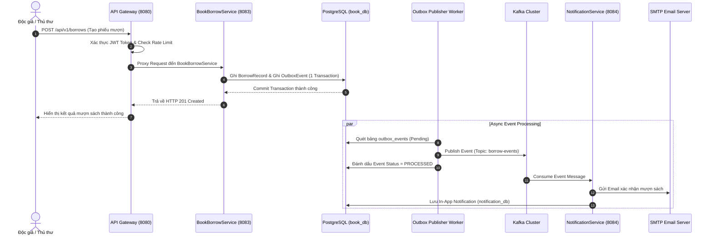

# 📚 Hệ Thống Quản Lý Thư Viện (Library Microservices)

Hệ thống quản lý thư viện hiện đại được xây dựng theo kiến trúc **Microservices** với **Spring Boot 3**, **Spring Cloud**, **Apache Kafka**, **Redis**, **PostgreSQL** và **React (Vite/TypeScript)**. 

Hệ thống hỗ trợ phân quyền người dùng (Thủ thư & Độc giả), quản lý đầu sách/bản sao, quy trình mượn - trả sách, theo dõi quá hạn và tự động gửi thông báo qua Email & In-App.

---

## 📐 1. Thiết Kế Mức Cao (High-Level Design - HLD)

### 1.1. Tổng Quan Kiến Trúc & Nguyên Lý Cốt Lõi (Architectural Principles)
Hệ thống Quản lý Thư viện được thiết kế theo chuẩn kiến trúc **Microservices hiện đại (Distributed Cloud-Native Architecture)** nhằm đảm bảo tính độc lập phát triển, khả năng mở rộng ngang (Horizontal Scalability), tính sẵn sàng cao (High Availability) và khả năng chịu lỗi (Fault Tolerance).

Các nguyên lý thiết kế hệ thống bao gồm:
- **Database-per-Service**: Mỗi microservice sở hữu cơ sở dữ liệu riêng biệt (`auth_db`, `user_db`, `book_db`, `notification_db`), ngăn chặn truy cập chéo trực tiếp ở tầng dữ liệu và loại bỏ sự phụ thuộc chặt (Tight Coupling).
- **API Gateway Pattern**: Triển khai `Spring Cloud Gateway` làm Single Entry Point duy nhất cho toàn bộ giao tiếp từ khách hàng/frontend. Tích hợp trung tâm xác thực JWT Filter, định tuyến động (Dynamic Routing), giới hạn tần suất (Rate Limiting) và ngắt mạch tự động (Circuit Breaker).
- **Centralized Service Discovery**: Triển khai `Netflix Eureka Server` để quản lý đăng ký động và phát hiện vị trí dịch vụ (IP/Port), hỗ trợ Client-side Load Balancing linh hoạt.
- **Event-Driven Architecture (EDA)**: Sử dụng **Apache Kafka Cluster** để truyền tin và xử lý sự kiện bất đồng bộ giữa các dịch vụ. Giảm nợ phụ thuộc synchronous REST call, cải thiện response time (Low Latency) cho các thao tác nghiệp vụ chính.
- **Transactional Outbox Pattern**: Đảm bảo tính nhất quán dữ liệu (Eventual Consistency) giữa ghi dữ liệu vào PostgreSQL và phát sự kiện ra Kafka mà không gây mất mát tin nhắn ngay cả khi dịch vụ gặp sự cố crash đột ngột.

---

### 1.2. Sơ Đồ Tổng Quan Kiến Trúc (System Architecture Diagram)

```
                                    +-----------------------+
                                    |     React Frontend    |
                                    |  (Vite / TypeScript)  |
                                    +-----------+-----------+
                                                | (HTTPS / REST)
                                                v
                                    +-----------------------+
                                    |      API Gateway      |
                                    |      (Port 8080)      |
                                    +-----------+-----------+
                                                |
            +-----------------------------------+-----------------------------------+
            | (Auth Verification & Dynamic Proxy)                                   |
            v                                   v                                   v
  +-------------------+               +-------------------+               +-------------------+
  |   Auth Service    |               |   User Service    |               |Book Borrow Service|
  |    (Port 8081)    |               |    (Port 8082)    |               |    (Port 8083)    |
  +---------+---------+               +---------+---------+               +---------+---------+
            |                                   |                                   |
            | (Redis Token                      |                                   | (Transactional Outbox)
            |  Blacklist)                       v                                   v
            v                         +-------------------+               +-------------------+
  +-------------------+               |  PostgreSQL / DB  |               |  PostgreSQL / DB  |
  |    Redis Cache    |               |     (user_db)     |               |     (book_db)     |
  |    (Port 6379)    |               +-------------------+               +---------+---------+
  +---------+---------+                                                             |
            ^                                                                       | (Publish Events)
            | (Rate Limit Data)                                                     v
  +---------+---------+                                                   +-------------------+
  |  PostgreSQL / DB  |                                                   |   Kafka Cluster   |
  |     (auth_db)     |                                                   | (3 Brokers / ZK)  |
  +-------------------+                                                   +---------+---------+
                                                                                    |
                                                                                    | (Consume Events)
                                                                                    v
                                                                          +-------------------+
                                                                          |NotificationService|
                                                                          |    (Port 8084)    |
                                                                          +---------+---------+
                                                                                    |
                                                                                    v
                                                                          +-------------------+
                                                                          |  PostgreSQL / DB  |
                                                                          | (notification_db) |
                                                                          +-------------------+
```

---

### 1.3. Các Dịch Vụ Thành Phần & Trách Nhiệm (Core Microservices)

| Dịch vụ | Cổng (Port) | Trách nhiệm chính (Core Responsibilities) | Cơ sở dữ liệu & Công nghệ |
| :--- | :--- | :--- | :--- |
| **API Gateway** | `8080` | Entry point duy nhất, định tuyến request, JWT Authentication Filter, Rate Limiting, Resilience4j Circuit Breaker. | Spring Cloud Gateway, Redis |
| **Discovery Server** | `8761` | Service Registry & Discovery, quản lý danh sách và theo dõi trạng thái sức khỏe (Healthcheck) của các dịch vụ. | Netflix Eureka Server |
| **Auth Service** | `8081` | Đăng ký, đăng nhập, mã hóa BCrypt, cấp phát JWT Access & Refresh Token, vô hiệu hóa Token khi Logout. | Spring Security, JWT, PostgreSQL (`auth_db`), Redis |
| **User Service** | `8082` | Quản lý hồ sơ người dùng (thông tin cá nhân, vai trò Thủ thư/Độc giả, địa chỉ, số điện thoại). | Spring Data JPA, PostgreSQL (`user_db`) |
| **Book Borrow Service** | `8083` | Quản lý danh mục sách, số lượng bản sao (BookCopy), tạo phiếu mượn/trả sách, tính hạn trả & tiền phạt quá hạn. | Spring Data JPA, Flyway, PostgreSQL (`book_db`), Kafka Producer |
| **Notification Service** | `8084` | Consumer tiêu thụ sự kiện từ Kafka (`borrow-events`, `overdue-events`), tự động gửi Email và lưu thông báo In-App. | Spring Mail, Kafka Consumer, PostgreSQL (`notification_db`) |
| **Lib Frontend** | `3000` | Giao diện React SPA (Vite/TypeScript) tối ưu trải nghiệm người dùng, tương tác đầy đủ tính năng cho Thủ thư & Độc giả. | React 18, TypeScript, Vanilla CSS Tokens, Nginx |

---

### 1.4. Mô Hình Giao Tiếp & Luồng Dữ Liệu (Data Flow & Communication Patterns)

#### 🔄 A. Giao tiếp Đồng bộ (Synchronous Communication - HTTP/REST)
- **Luồng Request của Người dùng**: Client gửi HTTP Request tới **API Gateway** -> API Gateway thực hiện xác thực Token JWT -> Tra cứu vị trí service từ **Eureka Discovery Server** -> Chuyển tiếp Request (Proxy Routing) đến microservice mục tiêu.
- **Mẫu Ngắt mạch (Circuit Breaker Pattern)**: Khi dịch vụ backend quá tải hoặc gián đoạn, Resilience4j trên API Gateway sẽ tự động ngắt mạch (Circuit Open) và trả về phản hồi fallback nhanh chóng thay vì gây tắc nghẽn hệ thống.

#### ⚡ B. Giao tiếp Bất đồng bộ & Hướng sự kiện (Asynchronous Event-Driven via Kafka)
Khi xảy ra các thao tác nghiệp vụ quan trọng (ví dụ: Độc giả mượn sách thành công hoặc Hệ thống phát hiện phiếu mượn quá hạn):
1. **Book Borrow Service** lưu thông tin mượn sách vào `book_db` đồng thời lưu sự kiện vào bảng `outbox_events` trong cùng **1 Database Transaction**.
2. Background worker (**Outbox Publisher**) quét các sự kiện chưa phát từ `outbox_events` và publish tin nhắn tới **Kafka Cluster** (Topic: `borrow-events`).
3. **Notification Service** (Consumer Group) nhận tin nhắn từ Kafka Topic, thực hiện:
   - Gửi Email xác nhận/nhắc nhở tự động cho Độc giả qua SMTP Mail Server.
   - Lưu thông báo vào `notification_db` để hiển thị trên hộp thư In-App của Frontend.



---

### 1.5. Mô Hình Dữ Liệu & Phân Lập Storage (Database Architecture)

Hệ thống tuân thủ nghiêm ngặt mô hình **Database-per-Service**:

```
+-----------------------------------------------------------------------------------+
|                                 DATABASE ARCHITECTURE                              |
+-------------------+ +-------------------+ +-------------------+ +-----------------+
|     auth_db       | |      user_db      | |      book_db      | | notification_db |
+-------------------+ +-------------------+ +-------------------+ +-----------------+
| - users_auth      | | - user_profiles   | | - books           | | - notifications |
| - roles           | | - addresses       | | - book_copies     | | - email_logs    |
| - user_roles      | +-------------------+ | - categories      | +-----------------+
+-------------------+                       | - borrow_records  |
                                            | - borrow_details  |
                                            | - outbox_events   |
                                            +-------------------+
```

- **Redis Cache (`6379`)**:
  - Lưu **Blacklist Tokens** (vô hiệu hóa tức thì JWT Access Token khi user đăng xuất).
  - Quản lý **Rate Limiting Counter** cho API Gateway.
  - Cache dữ liệu danh mục sách nâng cao hiệu năng truy vấn.

---

### 1.6. Bảo Mật & Phân Quyền Hệ Thống (Security Architecture)

- **Stateless Authentication**: Sử dụng chuẩn JWT (JSON Web Token) bao gồm Access Token (thời hạn ngắn, 15 - 60 phút) và Refresh Token (thời hạn dài, 7 ngày).
- **Role-Based Access Control (RBAC)**:
  - **`LIBRARIAN`**: Quyền quản trị toàn diện - Quản lý sách, quản lý bản sao, lập phiếu mượn/trả, xem danh sách người dùng, báo cáo thống kê.
  - **`BORROWER`**: Quyền độc giả - Tìm kiếm kho sách, mượn sách trực tuyến, xem lịch sử mượn trả cá nhân, nhận thông báo.
- **Centralized Security Enforcement**: API Gateway đứng ở vị trí tiền đồn giải mã và xác thực Token trước khi chuyển request vào mạng nội bộ microservices.

---

## 🛠️ 2. Công Nghệ Sử Dụng (Tech Stack)

### Backend
- **Framework**: Java 17, Spring Boot 4.1 / Spring Cloud 2025
- **Service Discovery & Gateway**: Eureka Discovery Server, Spring Cloud Gateway
- **Resilience & Rate Limit**: Resilience4j (CircuitBreaker & TimeLimiter), Redis RateLimiter
- **Database & Migration**: PostgreSQL 16, Flyway Migration, Spring Data JPA
- **Caching & In-Memory Storage**: Redis 7
- **Message Broker & Event-Driven**: Apache Kafka & Zookeeper (Cluster 3 Brokers)
- **Security**: Spring Security, JWT (JSON Web Token), OAuth2 Resource Server

### Frontend
- **Framework**: React 18, TypeScript, Vite
- **Web Server**: Nginx (Docker containerized)
- **UI & Icons**: Vanilla CSS (Custom Glassmorphism Design Token), FontAwesome Icons

### Infrastructure & DevOps
- **Containerization**: Docker, Docker Compose
- **Orchestration**: Healthcheck dependency chain, restart policies

---

## 📁 3. Cấu Trúc Thư Mục Project

```
Library/
├── ApiGateway/                # Spring Cloud Gateway Service
├── AuthService/               # Authentication & JWT Management Service
├── UserService/               # User Profile Service
├── BookBorrowService/         # Book & Borrow Transaction Service
├── NotificationService/       # Notification & Email Service
├── DiscoveryServer/           # Netflix Eureka Server
├── ConfigServer/              # Centralized Configuration Server (Optional)
├── lib-frontend/              # React / TypeScript Frontend Application
├── kafka/                     # Docker Compose config cho Kafka Cluster
├── postgres/                  # Init SQL scripts cho PostgreSQL databases
├── docker-compose.yml         # Container Orchestration toàn bộ hệ thống
└── README.md                  # Tài liệu hướng dẫn sử dụng
```

---

## 📋 4. Yêu Cầu Hệ Thống (Prerequisites)

Trước khi khởi chạy hệ thống, máy tính của bạn cần cài đặt:
- **Docker Desktop** (hoặc Docker Engine + Docker Compose v2)
- Khuyên dùng RAM khả dụng tối thiểu: **8 GB - 16 GB** (Do chạy nhiều microservices Java & Kafka cluster)

---

## ⚡ 5. Hướng Dẫn Cài Đặt & Khởi Chạy (Quick Start)

### Bước 1: Clone repository
```bash
git clone <repository-url>
cd Library
```

### Bước 2: Khởi tạo file cấu hình môi trường `.env`
Tạo file `.env` tại thư mục gốc `Library/` (nếu chưa có) với nội dung mẫu:

```env
DB_PASSWORD=root
AUTH_DB_PASSWORD=root
USER_DB_PASSWORD=root
BOOK_DB_PASSWORD=root
NOTIFICATION_PASSWORD=root
REDIS_PASS=redis123
JWT_SECRET_KEY=404E635266556A586E3272357538782F413F4428472B4B6250645367566B5970
APP_EMAIL=your-email@gmail.com
APP_EMAIL_PASSWORD=your-app-password
```

### Bước 3: Khởi chạy toàn bộ hệ thống bằng Docker Compose

```bash
docker compose up --build -d
```

> **Lưu ý**: Lần đầu tiên chạy, Docker sẽ tải ảnh và build các file JAR. Quá trình khởi động hoàn tất khi các container đạt trạng thái `healthy` (khoảng 1 - 2 phút).

### Bước 4: Kiểm tra trạng thái các service
```bash
docker compose ps
```

---

## 🌐 6. Các Cổng Dịch Vụ & Địa Chỉ Truy Cập

| Dịch Vụ | Cổng (Port) | URL Truy Cập / Healthcheck |
| :--- | :--- | :--- |
| **Giao diện Web (Frontend)** | `3000` | [http://localhost:3000](http://localhost:3000) |
| **API Gateway** | `8080` | [http://localhost:8080](http://localhost:8080) |
| **Eureka Discovery Server** | `8761` | [http://localhost:8761](http://localhost:8761) |
| **Auth Service** | `8081` | [http://localhost:8081](http://localhost:8081) |
| **User Service** | `8082` | [http://localhost:8082](http://localhost:8082) |
| **Book Borrow Service** | `8083` | [http://localhost:8083](http://localhost:8083) |
| **Notification Service** | `8084` | [http://localhost:8084](http://localhost:8084) |
| **PostgreSQL** | `5432` | `localhost:5432` |
| **Redis** | `6379` | `localhost:6379` |

---

## 🔑 7. Hướng Dẫn Khởi Tạo Tài Khoản (User Accounts & Roles)

Hệ thống được khởi tạo sẵn **2 Vai trò (Roles)** trong Database (`V202608142211__seed_role.sql`):
1. **`LIBRARIAN` (Thủ thư)**: Có quyền xem Dashboard hệ thống, tạo/sửa/xóa đầu sách, nhập bản sao, quản lý danh mục, lập phiếu mượn/trả sách và quản lý người dùng.
2. **`BORROWER` (Độc giả)**: Có quyền xem kho sách, thực hiện mượn sách trực tuyến, xem lịch sử mượn trả và nhận thông báo.

### 📝 Đăng ký tài khoản mới:
Do hệ thống không lưu cứng mật khẩu mẫu trong script migration, bạn có thể tạo tài khoản mới bằng 2 cách:
1. **Trên Giao diện Web (`http://localhost:3000`)**:
   - Nhấn nút **Đăng ký (Sign Up)** trên góc màn hình.
   - Điền thông tin Username, Password, Email, Họ tên và chọn Vai trò (`LIBRARIAN` hoặc `BORROWER`).
2. **Qua API (`POST /api/v1/auth/sign-up`)**:
   ```json
   {
     "username": "librarian1",
     "password": "yourpassword",
     "passwordConfirm": "yourpassword",
     "email": "librarian@example.com",
     "fullName": "Nguyễn Văn Thủ Thư",
     "phone": "0987654321",
     "role": "LIBRARIAN"
   }
   ```

---

## 📌 8. Danh Sách API Chính (Core Endpoints)

Tất cả API được gọi thông qua **API Gateway (`http://localhost:8080`)**:

### Authentication (`/api/v1/auth`)
- `POST /api/v1/auth/login`: Đăng nhập lấy JWT Token & Refresh Token.
- `POST /api/v1/auth/sign-up`: Đăng ký tài khoản độc giả mới.
- `POST /api/v1/auth/refresh`: Làm mới Access Token.
- `POST /api/v1/auth/logout`: Đăng xuất và đưa Token vào blacklist Redis.

### Users (`/api/v1/user`)
- `GET /api/v1/user/all`: Lấy danh sách người dùng (Dành cho Thủ thư).
- `GET /api/v1/user/profile`: Lấy thông tin cá nhân hiện tại.
- `GET /api/v1/user/search?keyword=...`: Tìm kiếm người dùng theo tên/email.

### Books & Categories (`/api/v1/books`, `/api/v1/categories`)
- `GET /api/v1/books`: Lấy danh sách tất cả các đầu sách và số lượng bản sao.
- `POST /api/v1/books`: Thêm đầu sách mới (Thủ thư).
- `POST /api/v1/books/{id}/import`: Nhập thêm số lượng bản sao cho đầu sách.
- `GET /api/v1/categories`: Lấy danh sách danh mục sách.

### Borrows (`/api/v1/borrows`)
- `POST /api/v1/borrows`: Tạo phiếu mượn sách mới.
- `PUT /api/v1/borrows/{borrowCode}/return`: Thực hiện thủ tục trả sách.
- `GET /api/v1/borrows/my-history`: Xem lịch sử mượn sách của độc giả hiện tại.
- `GET /api/v1/borrows/all`: Xem tất cả phiếu mượn hệ thống (Thủ thư).

---

## ❓ 9. Xử Lý Sự Cố Thường Gặp (Troubleshooting)

1. **Service hiển thị 503 "Server hiện tại không khả dụng" khi mới up xong**:
   - Các dịch vụ Spring Boot mất khoảng 30s - 45s để kết nối DB, nạp Hibernate và đăng ký lên Eureka. Vui lòng chờ đến khi lệnh `docker compose ps` báo tất cả dịch vụ ở trạng thái `healthy`.

2. **Muốn xem log của một service cụ thể**:
   ```bash
   docker compose logs -f api-gateway-service
   docker compose logs -f auth-service
   ```

3. **Khởi động lại toàn bộ từ đầu (Clean state)**:
   ```bash
   docker compose down -v   # Xóa toàn bộ container và volume dữ liệu cũ
   docker compose up --build -d
   ```

---

## 📝 10. Giấy Phép & Đóng Góp (License)
Dự án được phát triển phục vụ mục đích học tập và làm đồ án kiến trúc phần mềm Microservices.
